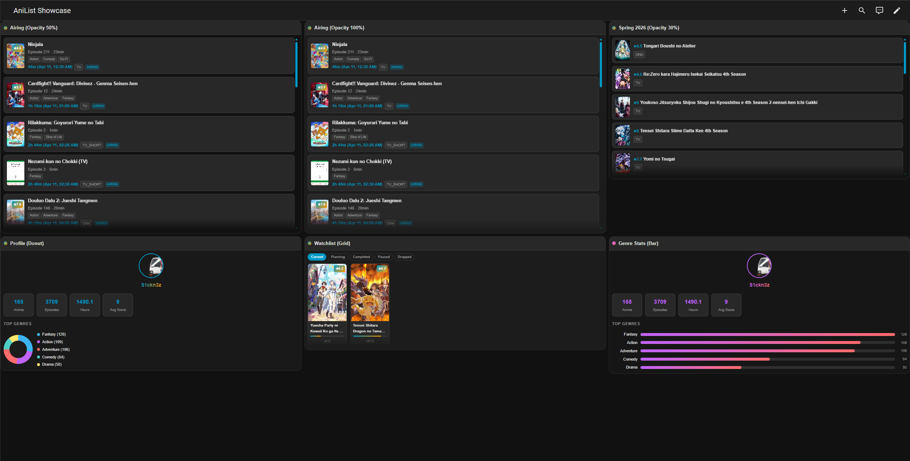
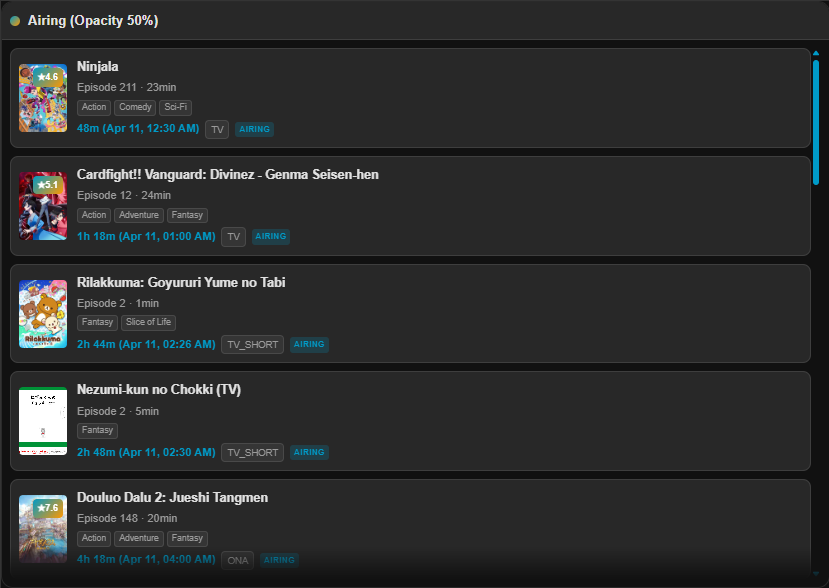
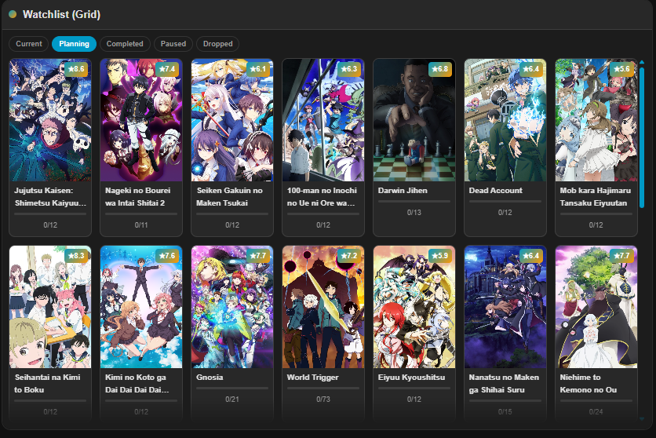
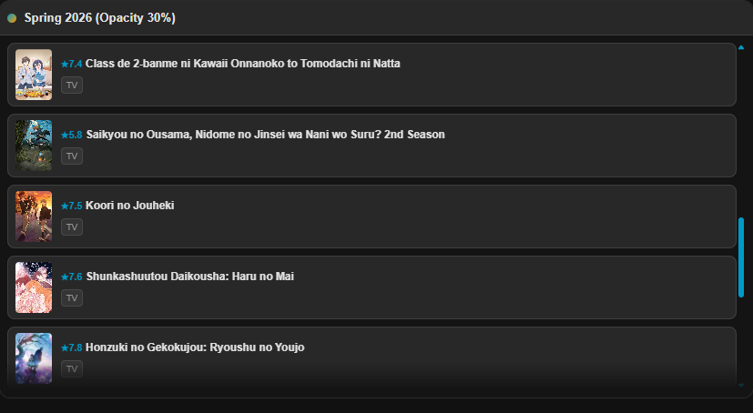
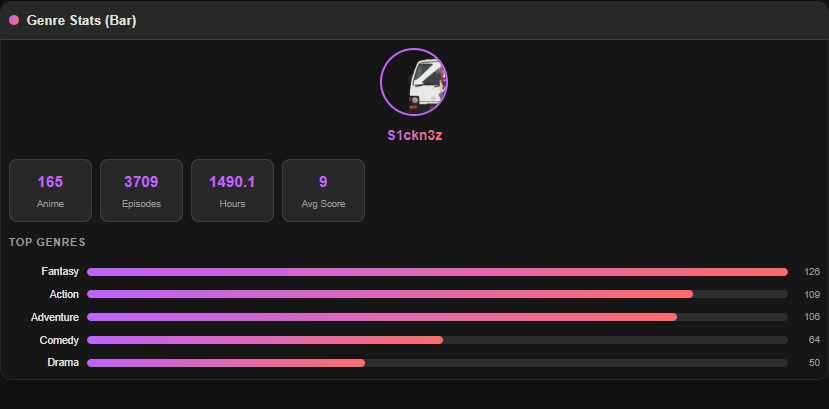

<p align="center">
  
</p>

<h1 align="center">🎌 AniList for Home Assistant</h1>

<p align="center">
  <a href="https://github.com/hacs/integration"></a>
  <a href="https://github.com/S1ckn3z/ha-anilist.co/releases"></a>
  <a href="https://github.com/S1ckn3z/ha-anilist.co/blob/main/LICENSE"></a>
  <a href="https://www.home-assistant.io/"></a>
  <a href="#-supported-languages"></a>
</p>

<p align="center">
  <a href="https://github.com/S1ckn3z/ha-anilist.co/releases"></a>
  <a href="https://github.com/S1ckn3z/ha-anilist.co/stargazers"></a>
  <a href="https://github.com/S1ckn3z/ha-anilist.co/issues"></a>
  <a href="https://github.com/S1ckn3z/ha-anilist.co/commits/main"></a>
  <a href="https://github.com/S1ckn3z/ha-anilist.co/actions"></a>
</p>

<p align="center">
  <b>Bring your anime & manga tracking into your smart home dashboard.</b><br>
  A full-featured <a href="https://www.home-assistant.io/">Home Assistant</a> custom integration for <a href="https://anilist.co">AniList.co</a> — with a custom Lovelace card, 5 views, HD covers, visual editor, and 23 languages.
</p>



---

## ⚡ Quick Install

### Via HACS (Recommended)

#### 🚀 One-Click Install

Click the button below to open this repository directly in your HACS:

[](https://my.home-assistant.io/redirect/hacs_repository/?owner=S1ckn3z&repository=ha-anilist.co&category=integration)

Then click **Download** → **Restart Home Assistant**. That's it! 🎉

#### 📝 Or Manually via HACS

1. Open **HACS** in your Home Assistant
2. Click **⋮** → **Custom repositories**
3. Add `https://github.com/S1ckn3z/ha-anilist.co` → Category: **Integration**
4. Search for **AniList** → Click **Install**
5. 🔄 **Restart Home Assistant**

> 💡 The Lovelace card is bundled and registers automatically — no manual resource setup needed!

### Manual Installation

1. Download `anilist.zip` from the [latest release](https://github.com/S1ckn3z/ha-anilist.co/releases)
2. Extract to `config/custom_components/anilist/`
3. 🔄 **Restart Home Assistant**

<details>
<summary>📄 YAML mode Lovelace? Click here</summary>

```yaml
resources:
  - url: /anilist-card/anilist-card.js
    type: module
```
</details>

---

## 🔧 Setup

After installation and restart, add the integration:

[](https://my.home-assistant.io/redirect/config_flow_start/?domain=anilist)

### 🔐 With AniList Account (Full Features)

1. Click the button above (or **Settings → Devices & Services → Add Integration**)
2. Search for **AniList**
3. Select **Sign in with AniList account (OAuth2)**
4. Authorize with your AniList credentials
5. ✅ All sensors and calendars are created automatically

### 🌐 Public Data Only (No Account)

1. Click the button above (or **Settings → Devices & Services → Add Integration**)
2. Search for **AniList**
3. Select **Public data only (no account required)**
4. ✅ Airing schedule and season data will be available

---

## ✨ Features

| | Feature | Description |
|---|---------|-------------|
| 📺 | **Airing Schedule** | Upcoming episodes with countdown timers |
| 📋 | **Watchlist** | Track currently watching anime with progress bars |
| 📖 | **Manga Reading List** | Chapter & volume progress tracking |
| 🗓️ | **Season Overview** | Browse current and next season anime |
| 👤 | **Profile Stats** | Your AniList stats, genres, and favourites |
| 🎨 | **Grid & List Layouts** | Switch between cover grids and list rows per view |
| 🖼️ | **HD Cover Images** | Configurable quality — small / medium / large |
| ⭐ | **Smart Score System** | User, average, or auto-detect — on covers or inline |
| ⚡ | **WebSocket API** | Bypasses the 16 KB attribute limit for unlimited data |
| 📅 | **4 Calendar Entities** | Airing, season, watchlist, and manga calendars |
| 📊 | **13 Sensor Entities** | Counts, scores, watch time, top genres, and more |
| 🃏 | **Custom Lovelace Card** | Built with Lit 3.x — responsive & themeable |
| 🖊️ | **Visual Card Editor** | Configure everything through the UI — no YAML needed |
| 🔒 | **OAuth2 Auth** | Secure login, or use public-only mode |
| 🌍 | **23 Languages** | Full i18n across integration, card, and editor |
| 🎭 | **HA Theme Support** | Automatically adapts to your HA theme colors |
| 📜 | **Scroll Control** | Pixel-perfect visible items, scroll-snap, fade indicators |

---

## 🃏 Lovelace Card

The AniList card appears as **"AniList"** in the card picker when adding a new card.

### 🖥️ Card Views

| View | Description | Auth Required |
|------|-------------|:------------:|
| 📺 `airing` | Upcoming episodes with countdown timers | ❌ |
| 📋 `watchlist` | Your anime watchlist with covers and progress | ✅ |
| 📖 `manga` | Manga reading list with chapter/volume tracking | ✅ |
| 🗓️ `season` | Season anime browser with scores and formats | ❌ |
| 👤 `profile` | Profile with stats, genre charts, and favourites | ✅ |

### 📸 Screenshots

<table>
  <tr>
    <td align="center" width="50%">
      <br>
      <b>📺 Airing</b> — Upcoming episodes with countdowns, genres, and format badges
    </td>
    <td align="center" width="50%">
      <br>
      <b>📋 Watchlist</b> — HD cover grid with status tabs, scores, and progress
    </td>
  </tr>
  <tr>
    <td align="center" width="50%">
      <br>
      <b>🗓️ Season</b> — Current season anime with scores and format badges
    </td>
    <td align="center" width="50%">
      <br>
      <b>👤 Profile</b> — Stats, genre charts, and favourites
    </td>
  </tr>
</table>

### 📝 YAML Examples

<details>
<summary>📺 Basic airing card</summary>

```yaml
type: custom:anilist-card
view: airing
max_items: 10
```
</details>

<details>
<summary>📋 Watchlist with all statuses and scrollbar</summary>

```yaml
type: custom:anilist-card
view: watchlist
show_status_tabs: true
watchlist_statuses:
  - CURRENT
  - PLANNING
  - COMPLETED
  - PAUSED
  - DROPPED
overflow_mode: scroll
scroll_height: 500
score_position: top-right
score_source: user
```
</details>

<details>
<summary>📖 Manga reading list</summary>

```yaml
type: custom:anilist-card
view: manga
show_status_tabs: true
overflow_mode: scroll
scroll_height: 400
show_progress_bar: true
```
</details>

<details>
<summary>🗓️ Season with genre/format filters</summary>

```yaml
type: custom:anilist-card
view: season
max_season: 20
genre_filter:
  - Action
  - Fantasy
format_filter:
  - TV
```
</details>

<details>
<summary>👤 Profile with donut chart</summary>

```yaml
type: custom:anilist-card
view: profile
show_avatar: true
show_username: true
show_anime_stats: true
show_manga_stats: false
show_genre_chart: true
chart_type: donut
show_favourites: false
```
</details>

<details>
<summary>🖼️ HD covers with scroll snap</summary>

```yaml
type: custom:anilist-card
view: watchlist
layout_mode: grid
cover_quality: large
score_position: top-right
score_source: auto
show_next_airing: true
visible_items: 5
scroll_snap: true
scroll_fade: true
```
</details>

<details>
<summary>🎨 Custom styled card</summary>

```yaml
type: custom:anilist-card
view: airing
accent_color: "#FF6B6B"
secondary_color: "#4ECDC4"
card_background: "#1a1a2e"
card_opacity: 90
border_radius: 16
border_width: 2
border_color: "#FF6B6B"
card_padding: compact
```
</details>

<details>
<summary>🏠 Full dashboard (sections layout)</summary>

```yaml
views:
  - title: AniList
    type: sections
    max_columns: 4
    sections:
      - cards:
          - type: custom:anilist-card
            view: airing
            max_items: 10
            show_countdown: true
      - cards:
          - type: custom:anilist-card
            view: watchlist
            overflow_mode: scroll
      - cards:
          - type: custom:anilist-card
            view: season
            max_season: 15
      - cards:
          - type: custom:anilist-card
            view: profile
            chart_type: bar
```
</details>

### 🖊️ Visual Editor

The card includes a full visual editor with three tabs:

- **⚙️ General** — View, title, padding, covers, score position, scroll settings
- **🎯 [View Name]** — Dynamic tab with view-specific options (layout, filters, tabs)
- **🎨 Colors** — Accent, background, opacity, borders

---

## ⚙️ Integration Options

After setup, click the ⚙️ gear icon on the AniList integration card:

| Option | Default | Description |
|--------|---------|-------------|
| `update_interval` | `15` | 🔄 Data refresh interval in minutes (5–60) |
| `title_language` | `romaji` | 🔤 Anime title language: `romaji`, `english`, `native` |
| `include_adult` | `false` | 🔞 Include adult-rated content |
| `airing_window_days` | `7` | 📅 How many days ahead for airing schedule (1–14) |
| `media_formats` | all | 🎬 Filter airing + season by format: `TV`, `TV_SHORT`, `MOVIE`, `SPECIAL`, `OVA`, `ONA`, `MUSIC` |
| `excluded_genres` | none | 🚫 Genres to exclude from season data |
| `score_format` | `POINT_10` | ⭐ Score display: `POINT_10`, `POINT_100`, `POINT_5`, `SMILEY` |
| `watchlist_statuses` | `CURRENT, REPEATING` | 📋 Anime statuses for calendar |
| `manga_statuses` | `CURRENT, REPEATING` | 📖 Manga statuses for calendar |
| `show_airing_calendar` | `true` | 📅 Enable airing schedule calendar |
| `show_season_calendar` | `true` | 🗓️ Enable season calendar |
| `calendar_reminder_offset` | `0` | ⏰ Calendar reminder offset in minutes |

---

## 📊 Card Configuration Reference

<details>
<summary>📐 General Options</summary>

| Option | Type | Default | Description |
|--------|------|---------|-------------|
| `type` | string | *required* | Must be `custom:anilist-card` |
| `view` | string | `airing` | Card view: `airing`, `watchlist`, `season`, `profile`, `manga` |
| `title` | string | auto | Custom card title |
| `max_items` | number | `5` | Global max items |
| `max_airing` / `max_watchlist` / `max_season` / `max_manga` | number | — | Per-view max override |
| `entry_id` | string | — | Config entry ID (multi-account only) |
</details>

<details>
<summary>🖼️ Display & Layout</summary>

| Option | Type | Default | Description |
|--------|------|---------|-------------|
| `show_cover` | boolean | `true` | Show cover images |
| `cover_size` | string | `medium` | Size: `small` (40x56), `medium` (48x68), `large` (64x90) |
| `layout_mode` | string | per-view | `grid` (covers) or `list` (rows) |
| `cover_quality` | string | `large` | Resolution: `small`, `medium`, `large` (HD) |
| `show_countdown` | boolean | `true` | Show countdown (airing view) |
| `countdown_format` | string | `relative` | `relative`, `absolute`, or `both` |
| `show_progress` | boolean | `true` | Show episode/chapter progress |
| `show_progress_bar` | boolean | `true` | Visual progress bar |
| `show_badges` | boolean | `true` | Status badges |
| `show_search` | boolean | `false` | Search/filter input |
| `show_tooltips` | boolean | `false` | Details on hover |
| `link_target` | string | `anilist` | `anilist` (open in new tab) or `none` |
| `sort_by` | string | `time` | Airing sort: `time`, `title`, `score` |
| `card_padding` | string | `normal` | `compact`, `normal`, `relaxed` |
</details>

<details>
<summary>⭐ Score System</summary>

| Option | Type | Default | Description |
|--------|------|---------|-------------|
| `score_position` | string | `top-right` | Badge on covers: `top-left`, `top-right`, `bottom-left`, `bottom-right`, `inline`, `none` |
| `score_source` | string | `auto` | `user` (your rating), `average` (community), `auto` (smart per view) |
| `show_next_airing` | boolean | `true` | Next episode countdown on covers |
</details>

<details>
<summary>📜 Scroll Behavior</summary>

| Option | Type | Default | Description |
|--------|------|---------|-------------|
| `visible_items` | number | — | Items visible before scrolling (auto-calculates height) |
| `scroll_snap` | boolean | `false` | Snap to item boundaries |
| `scroll_fade` | boolean | `false` | Gradient fade indicator |
| `overflow_mode` | string | `scroll` | `scroll` (scrollbar) or `limit` (cut at max) |
| `scroll_height` | number | `400` | Max height in px (scroll mode) |
</details>

<details>
<summary>📺 Airing Extras</summary>

| Option | Type | Default | Description |
|--------|------|---------|-------------|
| `show_duration` | boolean | `false` | Show episode duration |
| `show_genres` | boolean | `false` | Show genre tags |
| `show_average_score` | boolean | `false` | Show community score |
| `show_format_badge` | boolean | `false` | Format badge (TV, Movie, OVA) |
</details>

<details>
<summary>📋 Watchlist / 📖 Manga</summary>

| Option | Type | Default | Description |
|--------|------|---------|-------------|
| `watchlist_statuses` | string[] | all | `CURRENT`, `PLANNING`, `COMPLETED`, `PAUSED`, `DROPPED`, `REPEATING` |
| `show_status_tabs` | boolean | `true` | Tab buttons for status switching |
</details>

<details>
<summary>🗓️ Season</summary>

| Option | Type | Default | Description |
|--------|------|---------|-------------|
| `genre_filter` | string[] | `[]` | Only show matching genres |
| `format_filter` | string[] | `[]` | Only show matching formats |
</details>

<details>
<summary>👤 Profile</summary>

| Option | Type | Default | Description |
|--------|------|---------|-------------|
| `show_avatar` | boolean | `true` | User avatar |
| `show_username` | boolean | `true` | Username display |
| `show_anime_stats` | boolean | `true` | Anime statistics |
| `show_manga_stats` | boolean | `true` | Manga statistics |
| `show_genre_chart` | boolean | `true` | Genre visualization |
| `chart_type` | string | `bar` | `bar`, `donut`, or `tags` |
| `show_favourites` | boolean | `true` | Favourite anime list |
</details>

<details>
<summary>🎨 Styling</summary>

| Option | Type | Default | Description |
|--------|------|---------|-------------|
| `accent_color` | string | — | Primary accent color (hex) |
| `secondary_color` | string | — | Secondary accent (hex) |
| `card_background` | string | — | Background color (hex/rgba) |
| `card_opacity` | number | `100` | Background opacity (0–100) |
| `border_color` | string | — | Border color |
| `border_width` | number | — | Border width (px) |
| `border_radius` | number | — | Border radius (px) |
</details>

---

## 📊 Sensors

All sensors are created under `sensor.anilist_*`.

### 🌐 Public Sensors

| Entity ID | Description | Unit |
|-----------|-------------|------|
| `sensor.anilist_airing_today` | 📺 Anime airing today | anime |
| `sensor.anilist_episodes_this_week` | 📅 Episodes in airing window | episodes |
| `sensor.anilist_next_episode_title` | 🎬 Next airing anime title | — |
| `sensor.anilist_next_episode_time` | ⏰ Next episode timestamp | timestamp |

### 🔐 Authenticated Sensors

| Entity ID | Description | Unit |
|-----------|-------------|------|
| `sensor.anilist_watching_count` | 👁️ Currently watching | anime |
| `sensor.anilist_manga_reading_count` | 📖 Currently reading | manga |
| `sensor.anilist_total_anime_watched` | 📺 Total anime count | anime |
| `sensor.anilist_total_episodes_watched` | ▶️ Total episodes watched | episodes |
| `sensor.anilist_total_hours_watched` | ⏱️ Total watch time | hours |
| `sensor.anilist_anime_mean_score` | ⭐ Average anime score | — |
| `sensor.anilist_manga_mean_score` | ⭐ Average manga score | — |
| `sensor.anilist_chapters_read` | 📖 Total chapters read | chapters |
| `sensor.anilist_top_genre` | 🏷️ Top genre by count | — |

---

## 📅 Calendars

| Entity ID | Description | Auth |
|-----------|-------------|:----:|
| `calendar.anilist_airing_calendar` | 📺 All episodes in airing window | ❌ |
| `calendar.anilist_season_calendar` | 🗓️ Current & next season anime | ❌ |
| `calendar.anilist_watchlist_calendar` | 📋 Filtered to your watchlist | ✅ |
| `calendar.anilist_manga_calendar` | 📖 Your manga reading list | ✅ |

---

## ⚡ WebSocket API

The card uses a dedicated WebSocket API (`anilist/*`) for full data access, bypassing the 16 KB sensor attribute limit:

- 📦 **Unlimited items** — full watchlist, manga, schedule (no truncation)
- 🖼️ **HD cover images** — all sizes with accent color
- 🔤 **Multi-language titles** — romaji, english, native
- 🔍 **Server-side filtering** — status, genre, format
- 📄 **Pagination** — limit/offset on all endpoints

**Endpoints:** `anilist/airing_schedule` · `anilist/watchlist` · `anilist/season` · `anilist/manga` · `anilist/profile`

> 💡 The card automatically falls back to sensor attributes when the WebSocket API is unavailable.

---

## 🤖 Automations

### 🔔 Notify When an Episode Airs

```yaml
automation:
  - alias: "AniList: New episode notification"
    trigger:
      - platform: event
        event_type: anilist_episode_airing
    action:
      - service: notify.mobile_app
        data:
          title: "New Episode Available"
          message: "{{ trigger.event.data.title }} - Episode {{ trigger.event.data.episode }}"
          data:
            image: "{{ trigger.event.data.cover_image }}"
            clickAction: "{{ trigger.event.data.site_url }}"
```

### 📬 Daily Airing Summary

```yaml
automation:
  - alias: "AniList: Daily airing summary"
    trigger:
      - platform: time
        at: "08:00:00"
    condition:
      - condition: numeric_state
        entity_id: sensor.anilist_airing_today
        above: 0
    action:
      - service: notify.mobile_app
        data:
          title: "Anime Today"
          message: "{{ states('sensor.anilist_airing_today') }} anime airing today"
```

---

## 🌍 Supported Languages

The integration, Lovelace card, and visual card editor are fully translated into **23 languages**:

| | Language | Code | | Language | Code | | Language | Code |
|---|----------|------|-|----------|------|-|----------|------|
| 🇬🇧 | English | `en` | 🇫🇮 | Finnish | `fi` | 🇷🇴 | Romanian | `ro` |
| 🇩🇪 | German | `de` | 🇨🇿 | Czech | `cs` | 🇭🇺 | Hungarian | `hu` |
| 🇪🇸 | Spanish | `es` | 🇸🇰 | Slovak | `sk` | 🇧🇬 | Bulgarian | `bg` |
| 🇫🇷 | French | `fr` | 🇵🇱 | Polish | `pl` | 🇬🇷 | Greek | `el` |
| 🇮🇹 | Italian | `it` | 🇸🇪 | Swedish | `sv` | 🇹🇷 | Turkish | `tr` |
| 🇵🇹 | Portuguese | `pt` | 🇩🇰 | Danish | `da` | 🇺🇦 | Ukrainian | `uk` |
| 🇳🇱 | Dutch | `nl` | 🇳🇴 | Norwegian | `nb` | 🇷🇺 | Russian | `ru` |
| 🇯🇵 | Japanese | `ja` | 🇭🇷 | Croatian | `hr` | | | |

> 🔄 Language is automatically detected from your Home Assistant setting — no configuration needed!

---

## ❓ FAQ

<details>
<summary>❌ Card shows "No episodes in the coming days"</summary>

- Make sure the AniList integration is running (check **Settings → Devices & Services**)
- Check if sensors exist under **Developer Tools → States** (search `sensor.anilist_`)
- The airing window defaults to 7 days — increase it in options if needed
</details>

<details>
<summary>❌ Card shows "No profile stats available"</summary>

- Profile data requires OAuth2 authentication
- Public-only mode only provides airing and season data
</details>

<details>
<summary>🖼️ Cover images not loading</summary>

- AniList serves images from `s4.anilist.co` — check network access
- Check browser console for CORS or CSP errors
</details>

<details>
<summary>🖊️ Visual editor doesn't show all options</summary>

- Options are shown dynamically based on the selected view
- Switch the view in the **General** tab to see view-specific settings
</details>

<details>
<summary>🃏 How to use multiple cards on one page?</summary>

- Add multiple `custom:anilist-card` instances with different `view` values
- Use the HA **Sections** view type with `max_columns: 4` for a dashboard layout
</details>

---

## 📋 Requirements

- 🏠 Home Assistant **2025.2.0** or newer
- 📦 HACS **2.0.5** or newer (for HACS installation)
- 🎌 AniList account (optional — public data works without one)

---

## 🤝 Contributing

Contributions are welcome! Please open an issue first to discuss changes.

1. 🍴 Fork the repository
2. 🌿 Create a feature branch (`git checkout -b feature/my-feature`)
3. 📦 Install dependencies: `npm install`
4. ✏️ Make your changes
5. 🔨 Build the card: `npm run build`
6. 🧪 Test in a local HA instance
7. 🚀 Submit a pull request

<details>
<summary>🛠️ Development Setup</summary>

```bash
# Install dependencies
npm install

# Build the card (one-time)
npm run build

# Watch mode (auto-rebuild on changes)
npm run watch
```

The card source is in `src/card/` and builds to `www/anilist-card/anilist-card.js`.
</details>

---

## 📄 License

This project is licensed under the **MIT License** — see the [LICENSE](LICENSE) file for details.

---

<p align="center">
  Made with ❤️ for the anime community<br>
  <a href="https://anilist.co">AniList.co</a> · <a href="https://www.home-assistant.io/">Home Assistant</a>
</p>

